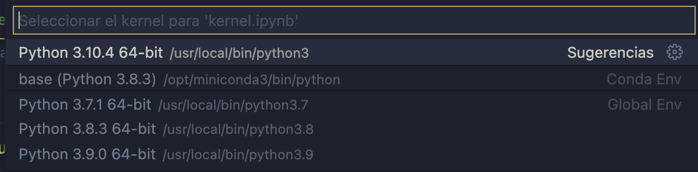

# Tutorial Entornos Virtuales Python

## Rquisitios:
* Un editor de texto
* Conocimiento básico de Consola/Terminal

## Introducción:

A la hora de trabajar paquetes para python, se pueden crear entornos donde requeriras tener versiones especificas para evitar temas de conflictos. Ya sea que siempre trabajes con 1 librería, no esta de más tener su ambiente virtual.


Como puedes ver en la imagen, llegaremos a tener diferentes proyectos donde en algunos, estaremos utilizando librerías diferentes o hasta versiones diferentes de Python. 

Tal vez puedas instalar todas en tu computadora e importarlas cuando se requieran pero ademas de las buenas practicas, a la hora de exportar tu proyecto, necesitaras en listar las librerias utilizadas en un archivo llamado Requeriments que le ayuda a los demas a instalar las librerias utilizadas justamente en otro ambiente virtual.


## Paso 1. Verificar la version de python

Dependiendo la version de python que tienes, es el ambiente virtual que podras trabajar. Podras encontrar tuturiales que utilizan la libreria virtualvenv y que se debe de instalar pero aquí estaremos utilizando el módulo venv que ya viene en las ultimas versiones de python.

Si nunca hemos trabajado con archivos `.py` y solo notebooks, ahí nos dice que version esta trabajando nuestro kernel.

1. Crearemos un archivo `.ipybn`con cualquier nombre en nuestro editor de texto que es el formato para los notebooks. (Crea una carpeta donde trabajaras este tutorial)

2. Dentro de una celda de código, ejecutaremos un `print("Hola Mundo")` y nos preguntara con que kernel deseamos trabajar. 



Si no llegara a preguntarnos, este se encuentra en la esquina superior derecha.

3. Verificamos que esta version sea la que tenemos en nuestra consola

Entraremos a nuestra consola y dependiendo el sistemas operativo, utilizaremos el comando

**Windows**: `python --version` o `py --version` 

**Mac/Linux** `python3 --version`

Está nos debe dar como resultado la misma version que tenemos de kernel para nuestro editor de texto.
```Bash
Python 3.10.4
```

## Paso 2. Ejecutar el comando para crear un entorno virtual 

Una ves que verificamos cual es la version, utilizaremos ese mismo comando para crear el módulo venv. Para esto debemos estar **posicionados en la carpeta** donde vamos a crear el ambiente. Puedes hacerlo de 2 maneras.

* Si ya tienes el editor de texto abierto en la carpeta que creaste para este tutorial, solo debes ir a las opciones de ventana, buscar la pestaña Terminal, abrir una nueva terminal y esta ya se encontara posicionada en la carpeta.

* Abrir una terminal y moverte entre carpetas con el comando `cd` hasta la carpeta de este tutorial, debe aparecerte algo así:

(Ejemplo en Windows)
```Bash
C:\Users\Daniel\Desktop\Tutorial-ambiente-virtual>
```

Y dependiendo de tu Sistema Operativo utilizaremos el comando de python que usaste en el punto 3 del paso 1:

**Windows**: `python -m venv tutorial-env` o `py -m venv tutorial-env` 

**Mac/Linux** `python3 -m venv tutorial-env`

Este te creara una carpeta llamada `tutorial-venv` o `venv`

## Paso 3. Activar tu entorno virtual

Para activarlo, solo ejecutaremos un comando que es diferente para cada Sistema Operativo:

En Windows, ejecuta:

```Bash
tutorial-env\Scripts\activate.bat
```
En Unix o MacOS, ejecuta:

```Bash
source tutorial-env/bin/activate
```

Una vez activado, veras un ligero cambio en tu consola que te mostrara que acabas de entrar a un ambiente virtual.

## Paso 4. Instalar una librería 

Para probrar nuestor ambiente virtual, instalaremos una librería utilizando el manejador de paquetes pip

En Windows, ejecuta:

```Bash
pip install pandas
```
En Unix o MacOS, ejecuta:

```Bash
pip3 install pandas
```

Se empezaran a instalar los paquetes que se necesitan solo en el ambiente virtual.

Para verificar cuales se instalaron, puedes utilizar el comando:
```Bash
pip freeze
```
En Unix o MacOS, ejecuta:

```Bash
pip3 freeze
```

## Paso 5. Apagar el ambiente virtual

Si ya no trabajaras en el ambiente, debes apagarlo con el comando:

```Bash
deactivate
```

Este de regresara al estado normal de la terminal.

