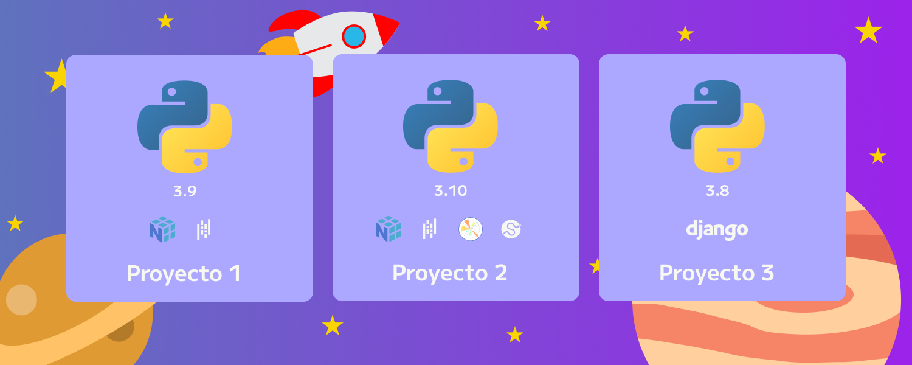

# Tutorial Entornos Virtuales Python

## Introducción:

A la hora de trabajar paquetes para python, se pueden crear entornos donde requeriras tener versiones especificas para evitar temas de conflictos. Ya sea que siempre trabajes con 1 librería, no esta de más tener su ambiente virtual.

